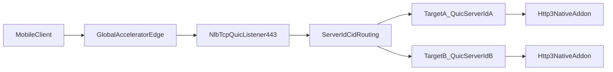

# AWS GA + NLB QUIC Passthrough

This document describes how to run `@currentspace/http3` behind AWS Global
Accelerator and Network Load Balancer QUIC passthrough.

## Target Data Flow



## CID Contract

When `quicLb` is enabled, server-generated SCIDs follow QUIC-LB plaintext CID
format:

- first octet:
  - high 3 bits: config rotation codepoint (current implementation uses `000`)
  - low 5 bits: random bits
- octets 2-9: 8-byte server ID
- remaining octets: random bytes

The CID length remains `quiche::MAX_CONN_ID_LEN` (20 bytes).

## Application Configuration

Use server options:

- `quicLb: true`
- `serverId: "0x1122334455667788"` (or an 8-byte `Buffer`)
- recommended for mobile migration-heavy traffic:
  - `disableActiveMigration: false`

Example:

```ts
createSecureServer({
  key,
  cert,
  quicLb: true,
  serverId: '0x1122334455667788',
  disableActiveMigration: false,
});
```

## NLB Target Registration Lifecycle

For QUIC/TCP_QUIC target groups, register each target with a unique
`QuicServerId`:

```bash
aws elbv2 register-targets \
  --target-group-arn <target-group-arn> \
  --targets Id=<target-id>,Port=443,QuicServerId=0x1122334455667788
```

Guidance:

- A target's `QuicServerId` should remain stable while it serves traffic.
- To change a target's `QuicServerId`, deregister and re-register the target.
- During rollouts, drain connections before removing targets to avoid
  unexpected packet drops for migrating clients.

## Failover Caveats

- If a target is removed before clients retire old CIDs, migrated packets can
  hit unknown-server-id drops.
- Keep deregistration delay and app shutdown drain long enough for active
  sessions to close.
- Preserve retry/session behavior during deployment to avoid churn in CID usage.

## Recommended CloudWatch Metrics

- `QUIC_Unknown_Server_ID_Packet_Drop_Count`
- `ProcessedBytes_QUIC`
- `NewFlowCount_QUIC`

Set alarms on `QUIC_Unknown_Server_ID_Packet_Drop_Count` and investigate any
non-zero sustained increase as a config mismatch between app `serverId` and NLB
`QuicServerId` registrations.
